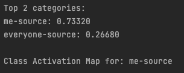
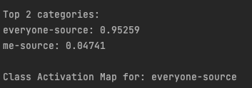

# CSE40868-NeuralNetworks-Final-Solution
Name    | Colin Lo  
NetID   | hlo2

## How to run

## 1. Description of Test Database

There are 2 database I am using, one is for testing myself, another one is for testing everyone else.
The test database for testing myself is from the images I took every day.
The another database is from [Labeled Faces in the Wild](http://vis-www.cs.umass.edu/lfw/#download).
Both of them contain 45 images (10% of the original data source used for training), and each image is 250x250 pixels.

For the image of myself, every selfie I took have different angles, lighting, environment, e.g. snowy, rainy, sunny, for over 3 months. 
It provides a wide range of variations for the testing data. As it is taken by myself, I could control how extreme data can be, there are blurry images due to slow shutter speed and slightly out of focus images as well. Because each image is unique, both training and testing set provides different data for determining the generalisation of the model.

For the image of everyone else, both the training and testing dataset contains different races, age, color, etc.
The testing dataset provides a wide variety of faces. Each face is unique from each other, as these data are captured from the Internet, it provides even greater diversity, such as environment, lighting and angles. Some images taken from basketball court, meeting room, soccer field, etc. Hence, provide unique dataset to test the generalisation. 

Since the ultimate goal of this binary classification is to distinguish my face out of other faces. With extreme data under different conditions from both database for myself and everyone. I believe these image variations could test the generalisation capabilities of my final program.

## 2. Classification Accuracy

Since the 100% accuracy is obtained in both classes in the first solution. I moved on to create an improved version of this model to provide a more practical use of it. I will explain the improved model in later part of the report.

Below is the accuracy for the model.

### 1. Training Accuracy

### 2. Validation Accuracy

It obtained nearly 98% accuracy in the validation, which is a pretty high accuracy. Compare to the first solution, it dropped slightly, but in later part of the report, I will explain how the model is capable in more practical scenarios and greater generalisation.

### 3. Graph for Accuracy and Loss

## 3. Reasons for Bad Performance and Improvements To Lower Observed Error Rates

### 1. Reasons for Bad Performance

My model did a pretty good job in classifying the images.

Therefore, to give a brief idea what are my kernels are doing, I visualise them.
Below is the 5th Convolution Layer.

To visualise the data distribution, I used t-SNE to plot the graph for both the image of myself and everyone else. 

As we could see both classes is quite seperated apart in both ends, only very few data are wrongly predicted, which is a good sign.

After seeing this, I went to pick some even more extreme data to test the model and try to visualise what will happen using GradCam.

To give an even clearer idea of how the model is improved, I tested on both my first solution model and my new and improved model. The GradCam was chosen to display the heatmap on all the layers.

<table style="text-align: center">
<thead>
  <tr>
    <th width="5%">Correct Class</th>
    <th width="25%">Original Image</th>
    <th width="30%">First Solution</th>
    <th width="30%">Final Solution</th>
  </tr>
</thead>
<tbody>
  <tr>
    <td rowspan="3">Myself</td>
    <td rowspan="2"></td>
    <td></td>
    <td></td>
  </tr>
  <tr>
    <td></td>
    <td></td>
  </tr>
 <tr>
    <td>Classification</td>
    <td>Correct</td>
    <td>Correct</td>
  </tr>
  <tr>
    <td rowspan="3">Other</td>
    <td rowspan="2"></td>
     <td></td>
    <td></td>
  </tr>
<tr>
   <td></td>
    <td></td>
  </tr>
<tr>
    <td>Classification</td>
    <td>Correct</td>
    <td>Correct</td>
  </tr>
</tbody>
</table>

Both provide a pretty good job in determining the test data in the dataset, obtaining 97% above accuracy in identifying the correct class.

So we could move on testing more extreme data that I downloaded online, and pictures intentionally taken to test the generalisation.

<table style="text-align: center">
<thead>
  <tr>
    <th>Correct Class</th>
    <th width="20%">Original Image</th>
    <th width="25%">First Solution</th>
    <th width="25%">Final Solution</th>
    <th width="20%">Description</th>
  </tr>
</thead>
<tbody>
  <tr>
    <td rowspan="3">Myself</td>
    <td rowspan="2"></td>
    <td></td>
    <td></td>
    <td rowspan="3">
        I test this image because I am wearing headphones, and I would like to see if it affects any of the performance. 
    </td>
  </tr>
  <tr>
    <td></td>
    <td></td>
  </tr>
<tr>
    <td>Classification</td>
    <td>Incorrect</td>
    <td>Correct</td>
  </tr>
  <tr>
    <td rowspan="3">Myself</td>
    <td rowspan="2"></td>
     <td></td>
    <td></td>
    <td rowspan="3">
       I chose this image because my face appeared to be relatively on the side. My first model did a pretty bad job in identifying my face. However, my improved model could identify it with quite a high confident again.
    </td>
  </tr>
<tr>
    <td></td>
    <td></td>
  </tr>
<tr>
    <td>Classification</td>
    <td>Incorrect</td>
    <td>Correct</td>
  </tr>
</tbody>
</table>

From the GradCam images, we could see that the first solution model is trying to recognize the hair of myself and the surrounding, including the clothing and my body, while the improved model is trying to recognize the lower part of my face.  

<table style="text-align: center">
<thead>
  <tr>
    <th>Correct Class</th>
    <th width="20%">Original Image</th>
    <th width="25%">First Solution</th>
    <th width="25%">Final Solution</th>
    <th width="20%">Description</th>
  </tr>
</thead>
<tbody>
  <tr>
    <td rowspan="3">Other</td>
    <td rowspan="2"></td>
    <td></td>
    <td></td>
    <td rowspan="3">
    This image is chosen because of the face shape of Steve Carell have some similar to mine, I wanted to see if there are any effects.
    </td>
  </tr>
  <tr>
    <td></td>
    <td></td>
  </tr>
<tr>
    <td>Classification</td>
    <td>Correct</td>
    <td>Correct</td>
  </tr>
  <tr>
    <td rowspan="3">Other (Me 8 years ago)</td>
    <td rowspan="2"></td>
     <td></td>
    <td></td>
<td rowspan="3">
This image is me, but 8 years ago. It would not be fair to consider this class is "myself", since the training data does not include any images of myself before 2023.
But I am interested to see what the model will recognise with this image.
</td>
  </tr>
<tr>
    <td></td>
    <td></td>
  </tr>
<tr>
    <td>Classification</td>
    <td>Correct</td>
    <td>Correct</td>
  </tr>
</tbody>
</table>

On the contrast, the first solution model is trying to recognize the surrounding of the face. The improved model is trying to recognize the eyes, hair, clothing of the person instead.

### 2. Improvements To Lower Observed Error Rates

This part is to illustrate what I did in the improved model.

As we could see that the first solution model is not doing a great job in identifying the extreme data.

#### 1. Change of Optimizer and Epochs

I changed the optimizer from Adam to SGD, because instead of using Adam to converge to the solution quicker, I would like to use SGD to explore a bit more possibility. Therefore, I increased the training epochs from 5 to 15 to give a bit more time for the model to explore. 

#### 2. Change of Learning Rate

Since I used SGD for the optimizer, I would also like the model to slowly decrease the learning rate to find the optimal solution. I used exponential learning rate for this improved model, instead of a fixed learning rate.

#### 3. Add Dropout Layer

To reduce the dependency of the model on a particular neuron, I added a dropout layer with 50% of dropout rate, to give every neuron a equal chance to be dropped out, while restricting the model to train on different neurons.

So the current architecture looks like this.

|                                           Layers                                           |
|:------------------------------------------------------------------------------------------:|
|            Convolution 1   ReLU   Max Pooling   Batch Normalisation 1             |
|             Convolution   ReLU   Max Pooling   Batch Normalisation 2              |
|                                  Convolution 3   ReLU                                   |
|                                  Convolution 4   ReLU                                   |
|                          Convolution 5   ReLU   Max Pooling                          |
| Fully Connected 1   <b><i>Dropout</i></b>   ReLU   Fully Connected 2   Softmax |

#### 4. Normalize the Image

I was previously using `transforms.Normalize(mean=[0.5, 0.5, 0.5], std=[0.5, 0.5, 0.5])` to normalize the images for training, which is an arbitrary choice. But when I research more about what is the widely used normalize value for images, I figured out `transforms.Normalize(mean=[0.485, 0.456, 0.406], std=[0.229, 0.224, 0.225])` would be beneficial for neural networks to train, so I changed the transformation of the images as well.

#### 5. Change of Batch Size

I was using 50 as batch size previously, since I will increase the epoch time in the improved model, I would decrease the batch size. The model could update the layer in a smaller batch size. Also, after some research the batch size with power of 2 would increase training speed, so I chose 32 for the batch size.

#### 6. Add Visualisation Graph

As it would be easier to have an idea what the training is, I create graphs for displaying both training, validation accuracy and training, validation loss. 

