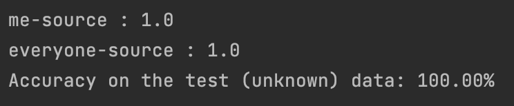

# CSE40868-NeuralNetworks-First-Solution
Name    | Colin Lo <br>
NetID   | hlo2

## How to run

Navigate to `neural_network_training.py`, scroll down to
```
    ############################
    ######## Start Here ########
    ############################
```
where you can see `mode = (xxx)` change to `mode = 'eval'` if not already. Then you can run the program.
It should show the accuracy of the model afterwards.

If it does not work (it may fail due to cpu/gpu allocation problem), you can try it to run in Jupyter Notebook `neural_network_training_backup.ipynb`.

Or even on [Google Collab](https://colab.research.google.com/drive/17pIl2DQPUI87Mgb2OWKIN_GN8XCaVA5L?usp=sharing), but you may have to download the model `CSE40868_final_project_best_model.pth` from the repository and upload to your own Google Drive to get it working.


## 0. Data and Preprocessing

1. Data

There are 450 images for both myself and everyone. Images of myself are images that I took everyday, and the images of everyone is downloaded from [Labeled Faces in the Wild](http://vis-www.cs.umass.edu/lfw/).

2. Preprocessing

Images from the database, Labeled Faces in the Wild are sized to be 250x250. 
As images of myself are in arbitrary dimension and there might be too much unrelated 
space around my face, I used the library MTCNN, to locate my face in the image, crop and down scale to 250x250.
Codes can be found in `preprocessing.py`.

## 1. Neural Network Architecture

1. Number and Types of Layers
The reason I chose 5 convolution layers, is because the sample data are all faces, and it is not that complex, facial features such as eyes, nose, mouth, skin color, etc could be extracted from 5 layers. There are 3 max pooling layers, the layers are used to down sample the image and extract the important features of the images. Batch normalization layers were used after 2 of the max pooling layer, to improve generalization of the model by reducing the effect of noise. The fully connected layers are used to learn the complex relationship between input and output features in the model and to provide a final classification for the output.

|                                 Layers                                 |
|:----------------------------------------------------------------------:|
|  Convolution 1 <br> ReLU <br> Max Pooling <br> Batch Normalisation 1   |
|  Convolution <br> ReLU <br> Max Pooling <br> Batch Normalisation 2     |
|                        Convolution 3 <br> ReLU                         |
|                        Convolution 4 <br> ReLU                         |
|                Convolution 5 <br> ReLU <br> Max Pooling                |
|    Fully Connected 1 <br> ReLU <br> Fully Connected 2 <br> Softmax     |

2. Loss Function
Cross entropy loss is used in this model. The lower the cross entropy is, the better it is. It measures the difference between the predicted probability and actual occurrence of the event, and adjusts the model to a lower cross entropy through back propagation.

4. Optimization Algorithm
Adam is used in the training. By keeping track of the mean gradients and the variance of the gradients, the algorithm can update the parameter based on the current and the previous estimation of the gradients.

## 2. Classification Accuracy

### 1. Training Accuracy


### 2. Validation Accuracy


## 3. Ideas for Improvement

1. Removing the Classification Layer

Since the model has a very high accuracy on the image set, I would like to try removing the last classification layer. Where I could directly get the values of the neurons and weight from the fully connected layers. This allows me to extend this project to a more practical use case, and extends beyond binary classification.

2. Extending it to Multiclass Classification

With the current binary classification model getting a relatively high accuracy, I could try doing multiclass classification on multiple people, e.g. celebrities, my family members, friends, etc. There are different dataset that categorize different celebrities, which is a possible solution.

3. Face Detection

Rather than extending it further, it is also possible to try going to the raw face detection direction. Face detecting would be a great direction to learn, where I could learn to develop a neural network that detects faces in an image. However, the complexity of face detection compared to binary classification may be much higher, and the data set may require much bigger as well as longer training time. I am not sure the feasibility for implementing this idea, would do further consultation to get a better understanding.

4. Face with Mask Recognition

It would be interesting to see what happens if I provide images with my mask on it. See if it is able to 
recognize my face with mask it. Other accessories such as no glasses would also another possible direction to explore
the face recognition.
